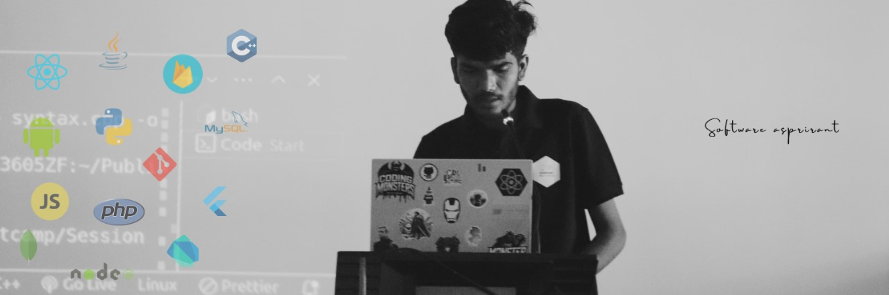

 

---

  
  
  

---

<h1 align="center">Hey 👋 I'm Nagesh Chillale</h1>

Backend-leaning Full Stack Developer | Spring Boot · React · Flutter · Data & Systems

---

## 👨‍💻 About Me

I’m a B.Tech IT student at **Walchand College of Engineering** with hands-on experience building
**backend systems, full-stack applications, and data-driven platforms**.

- 🔭 **Backend Development Intern @ EVarc**  
  Built Wallet Core APIs using AWS Lambda, MongoDB & clean layered architecture

- 📊 **Data Analysis Intern @ E-MC² Lab (VJTI)**  
  Processed 100k+ rows, performed EDA, and built analytical dashboards

- 🚀 Built production-grade projects with **sub-1s latency** and real users  
- 🧠 Strong fundamentals: **DSA, DBMS, OS, CN, REST APIs**  
- ⚡ Solved **330+ LeetCode problems** (75% acceptance)

---

## 🚀 Featured Projects

### 🔹 Futurecollege.com – Automated College Counselling Platform
**Tech:** React · Spring Boot · Python · MySQL  
- Eligibility prediction APIs with **P95 < 300 ms**
- Handled **1,200+ profiles** with **70%+ accuracy**
- Reduced DB reads by **28%** using indexing & query tuning
- Improved page load by **450 ms**, end-to-end latency < 1s

---

### 🔹 GetItEase – Campus Buy/Sell & Lost-Found App
**Tech:** Flutter · Dart · Firebase  
- **99% crash-free** sessions across 1,000+ interactions
- Authentication, validation & image compression
- **40% smaller uploads**, **22% increase** in successful posts

---

## 🧠 Engineering Mindset (What sets me apart)

- I focus on **why before how**
- I design APIs with **performance & scalability** in mind
- I document **design decisions**, not just code
- I optimize for **real users**, not demos

---

## 🛠 Languages & Tools

  
  
  
  
  
  
  
  
  
  
  
  
  
  
  
  
  

---

## 🔮 Currently Exploring (Future-Demand Skills)

- System design fundamentals for backend services
- API security (JWT, auth flows, rate limiting)
- Performance engineering & DB indexing
- AI-assisted developer tools & agent-based workflows

---

